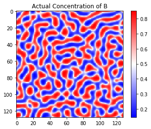

# Physics-Informed Neural Networks for Modeling Spinodal Decomposition in A-B Alloys

[](https://opensource.org/licenses/MIT)

A deep learning framework for simulating phase separation dynamics in binary alloys using Physics-Informed Neural Networks (PINNs) and the Cahn-Hilliard equation.

## Overview

## Repository Structure
```bash
PINNs_Cahn_Hilliard/
├── CH_dataset.ipynb
├── CHPINN.ipynb
├── README.md
├── LICENSE
├── requirements.txt
└── images/
    ├── predicted.png
    ├── actual.png
    └── error.png
```

This repository contains an implementation of:
1. **Cahn-Hilliard Equation Solver**: Numerical simulation of spinodal decomposition dynamics
2. **Physics-Informed Neural Network (PINN)**: Deep learning model that incorporates physical laws directly into the neural network architecture

The implementation predicts the temporal evolution of component concentrations in a virtual A-B alloy system undergoing phase separation.

## Features
- 🧠 Physics-informed neural network architecture
- 🧮 Numerical solution of 2D Cahn-Hilliard equation
- 📊 Dataset generation for phase separation dynamics
- 📈 Comparative analysis between PINN predictions and numerical simulations
- 🎯 Adaptive weighting of physical constraints in loss function

## Installation
1. Clone repository:

```bash
git clone https://github.com/yourusername/PINNs_Cahn_Hilliard.git
cd PINNs_Cahn_Hilliard
```

2. Install dependencies:

```bash
pip install -r requirements.txt
```

## Usage

### 1. Dataset Generation (`CH_dataset.ipynb`)
Adapted from the [Yamanaka Research Group implementation](http://web.tuat.ac.jp/~yamanaka/pcoms2019/Cahn-Hilliard-2d.html), this notebook:
- Simulates spinodal decomposition using finite difference method
- Generates temporal concentration profiles
- Saves simulation results as NumPy arrays (`Conc.npy`, `time.npy`)

**Key Parameters:**
```python
nx = 128  # Spatial resolution
nsteps = 2000  # Temporal resolution
La = 20000.-9.*temp  # Atom interaction energy
ac = 3.0e-14  # Gradient coefficient
```

### 2. PINN Implementation (`CHPINN.ipynb`)
Implements a physics-informed neural network that:
- Incorporates Cahn-Hilliard equation constraints
- Uses adaptive weighting for loss components
- Compares predictions with numerical simulations

**Architecture Highlights:**
```python
model = tf.keras.Sequential([
    tf.keras.layers.Dense(100, activation='tanh', input_shape=(3,)),
    tf.keras.layers.Dense(100, activation='tanh'),
    tf.keras.layers.Dense(1)
])
```

## Results
The implementation achieves:
- Quantitative agreement with numerical simulations (MSE < 0.01)
- Successful prediction of phase separation patterns
- Temporal evolution of concentration profiles

| Predicted Concentration | Actual Concentration | Error Distribution |
|-------------------------|-----------------------|--------------------|
|  |  |  |

## References
1. Yamanaka Research Group. (2019). Cahn-Hilliard Equation Solver. Tokyo University of Agriculture and Technology
2. Raissi, M., et al. (2019). Physics-informed neural networks. Journal of Computational Physics
3. Cahn, J. W., & Hilliard, J. E. (1958). Free energy of a nonuniform system. The Journal of Chemical Physics

## License
This project is licensed under the MIT License - see the [LICENSE](LICENSE) file for details.

